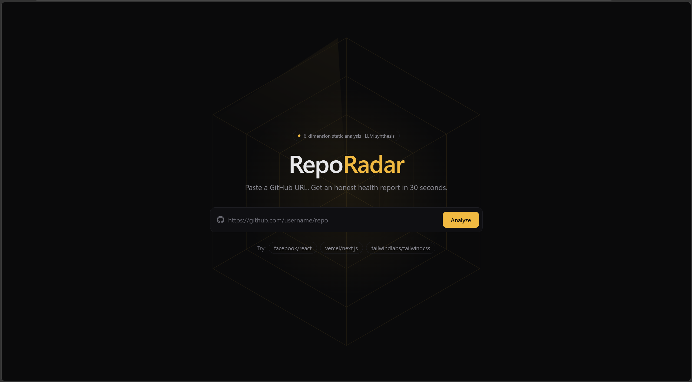
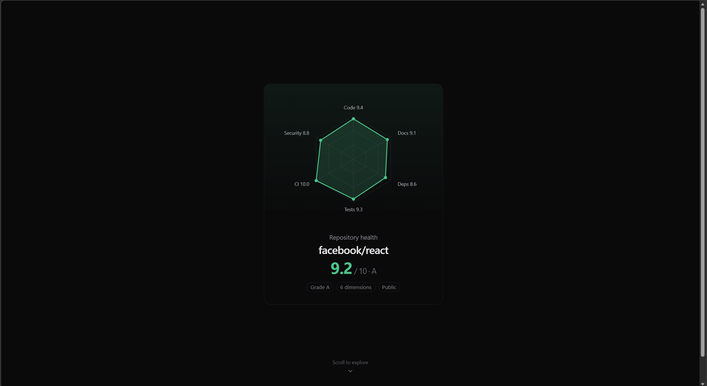
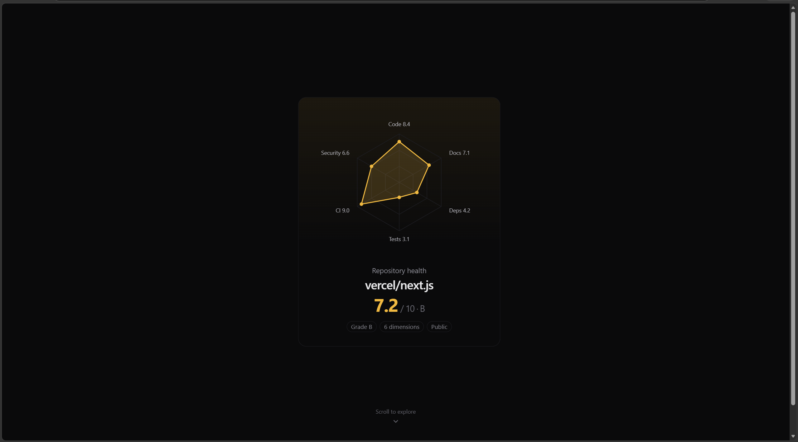
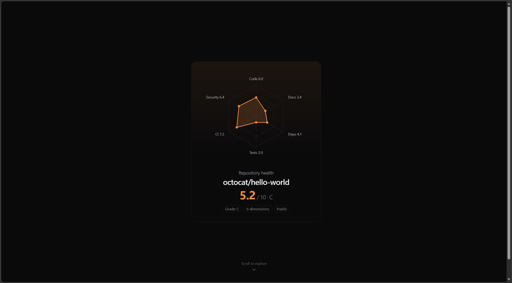
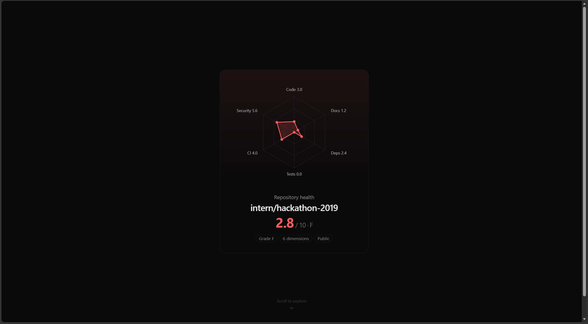

# RepoRadar

AI-powered GitHub repository health analyzer. Paste a public GitHub URL, get a scored report across 6 dimensions with LLM-synthesized recommendations and actionable fixes.

---

## Preview











---

## What it analyzes

| Dimension | What it checks |
|---|---|
| **Code Quality** | Cyclomatic complexity, maintainability index (radon) |
| **Documentation** | README presence, length, badges, contributing guide |
| **Dependencies** | Outdated packages, unpinned versions (PyPI) |
| **Tests** | Test file ratio, coverage indicators |
| **CI/CD** | GitHub Actions / CI config presence and structure |
| **Security** | Known vulnerability patterns, secrets, unsafe calls (bandit) |

Each dimension scores 0–10. An LLM synthesis chain (Groq → Gemini → Ollama → Templated fallback) writes a verdict, three-paragraph summary, and top fixes.

---

## Install

### Prerequisites

- Python 3.13+
- Node.js 18+
- Git on your PATH

```powershell
git clone https://github.com/your-username/RepoRadar.git
cd RepoRadar
```

**Backend dependencies:**

```powershell
cd backend
python -m venv radar-venv
radar-venv\Scripts\Activate.ps1
pip install -r requirements.txt
```

**Frontend dependencies:**

```powershell
cd frontend
npm install
```

---

## Usage

### 1. Configure LLM providers (optional)

Create `backend/.env`. All keys are optional — the chain falls back to a deterministic templated report if none are set.

```env
GROQ_API_KEY=gsk_...        # fastest tier (6s timeout) — free at console.groq.com
GEMINI_API_KEY=AIza...      # second tier (10s timeout) — free at aistudio.google.com
OLLAMA_URL=http://localhost:11434   # local tier — omit if not running Ollama
```

### 2. Start the backend

```powershell
cd backend
radar-venv\Scripts\Activate.ps1
radar-venv\Scripts\uvicorn.exe main:app --reload --port 8000
```

Health check: `http://localhost:8000/healthz`

### 3. Start the frontend

```powershell
cd frontend
npm run dev
```

App is at `http://localhost:5173`.

### 4. Analyze a repo

Paste any public GitHub URL (e.g. `https://github.com/psf/requests`) and hit **Analyze**. The radar chart fills spoke by spoke as each dimension completes, then the full report loads automatically.

> **Note:** Very large repos (e.g. `vercel/next.js`, `microsoft/vscode`) may time out the 30s clone window. Use mid-sized repos for best results.

### Ollama (optional — local LLM tier)

```powershell
# Install from https://ollama.com, then:
ollama pull mistral-nemo
```

The backend auto-warms Ollama on startup. Any model works; `llama3.1:8b` or `mistral-nemo:12b` recommended.

### Share features

- `/og/{report_id}.png` — 1200×630 OG image with real radar chart (for social sharing)
- `/badge/{report_id}.svg` — embeddable shields.io-style health badge

---

## Architecture

```
Browser
  └─ POST /analyze ──────────────────────────────────────► FastAPI
                                                              │
                                              git clone (shallow, temp dir)
                                                              │
                                        asyncio.gather ── 6 analyzers in parallel
                                                              │
                                              ┌─── SSE events ──► /report/{id}/stream
                                              │                        │
                                        synthesize                 Browser
                                      (4-tier chain)            (radar fills live)
                                      Groq → Gemini
                                      → Ollama → Templated
                                              │
                                        store report
                                              │
                                     GET /report/{id} ◄── Browser navigates
```

Six analyzers run in parallel. As each finishes it emits an SSE event — the radar chart fills spoke by spoke at real analysis speed, not a fake timer.

The synthesis chain validates LLM output against a structured schema (`VERDICT:` + 3 paragraphs + `TOP_FIXES:` list). A provider is rejected and the chain falls through if the model ignores the format.

---

## Local setup

### Running tests

```powershell
# Backend
cd backend
radar-venv\Scripts\Activate.ps1
pytest -v

# Frontend
cd frontend
npm test
```

---

## Contributing

Contributions are welcome. Please follow these steps:

1. Fork the repository and create a branch from `main`:
   ```powershell
   git checkout -b feat/your-feature-name
   ```

2. Make your changes. For backend changes, run the test suite before submitting:
   ```powershell
   cd backend && pytest -v
   ```
   For frontend changes:
   ```powershell
   cd frontend && npm test && npm run build
   ```

3. Keep PRs focused — one feature or fix per PR. Include a short description of what changed and why.

4. Open a pull request against `main`. The PR description should answer: *what does this change, and why is it better than the current behavior?*

### Adding a new analyzer

1. Create `backend/analyzer/dimensions/your_dimension.py` implementing `async def analyze(repo_path: str) -> DimensionResult`.
2. Add corresponding finding categories to `backend/rag/findings_library.json`.
3. Register the analyzer in `backend/main.py` inside `run_analysis`.
4. Add tests in `backend/tests/test_your_dimension.py`.

### Adding a new LLM provider

Implement the `LLMProvider` protocol in `backend/analyzer/synthesizer/chain.py` (requires `available() -> bool` and `async complete(prompt: str) -> str`), then append an instance to the `PROVIDERS` list in `main.py`.

---

## License

MIT — see [LICENSE](LICENSE).
